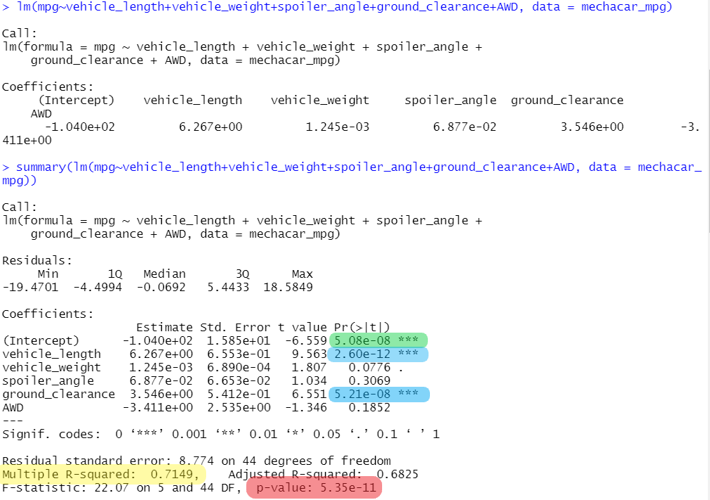

# MechaCar Statistical Analysis
### Overview
Use the programming language R to perform statistical analysis on datasets from the automotive industry. This production information will aide AutosRUs’ manufacturing team get thru some difficulties they have been having in the progress of their new prototype MechaCar. 

## Linear Regression to Predict MPG

The first value to observe is the p-value highlighted in red. With a value greater than .05 we reject the null hypothesis and conclude that there is a statistical significance within our variables and that our slope is not zero.
 

Above in the list of coefficients we can see three factors that significantly contribute to our ability to predict MPG. The first is green highlighted Intercept value which indicates that there are other variables not considered that contribute to MPG prediction. The two values highlighted in blue, vehicle length and ground clearance, demonstrate the variables with statistical significance (p > .05) and non-random amounts of variance.
 

The last value to focus, highlighted in yellow, is the r-squared value of 0.7149. This value shows us that our model effectively demonstrates 71% of the factors that contribute to our MPG prediction.
  

## Summary Statistics on Suspension Coils

 | Suspension Coil PSI Statistics | 

 | Suspension Coil PSI Statistics Lot Breakdown| 

 "The design specifications for the MechaCar suspension coils dictate that the variance of the suspension coils must not exceed 100 pounds per square inch."

 We can observer that there is to much variance in suspension coils data. It does not meet the design specification for all manufacturing lots in total. The first two lots have acceptable values of varraince within their coil production. The third lot does not, which would impact production and quality of the intire MechCar line. 

  ## T-Tests on Suspension Coils

 Our Ttests further indicate that Lot 3 has a much larger difference in mean values and that it does not meet needed specifications. 

  ## Study Design: MechaCar vs Competition
  
  If I were to assess the performance of MechaCar compared to its competitors, I would assess cost, fuel type, top speeds, maintenance cost, and warranty. My initial biased hypothesis is that MechaCar should outperform the competitors on these metrics. If the average performance of the MechaCar metric does not meet or exceed that of its competitors, then we can say that the null hypothesis is true. You could attempt ANOVA to measure speed performance and Single Linear Regressions to understand how MechaCar compares to the tope vehicles sold. In order to perform this study I would need data from all vehicles purchased over a period of time and I would need a manufacture specification and performance data. 
