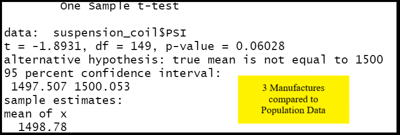
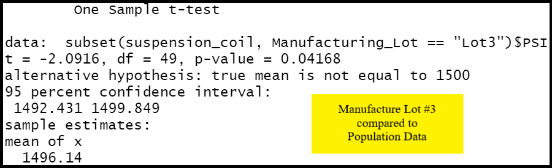

# MechaCar Statistical Analysis
### Overview
Use the programming language R to perform statistical analysis on datasets from the automotive industry. This production information will aide AutosRUs’ manufacturing team get thru some difficulties they have been having in the progress of their new prototype MechaCar. 

## Linear Regression to Predict MPG

## Summary Statistics on Suspension Coils

 | Suspension Coil PSI Statistics | 

 | Suspension Coil PSI Statistics | 

## T-Tests on Suspension Coils

## Study Design: MechaCar vs Competition
